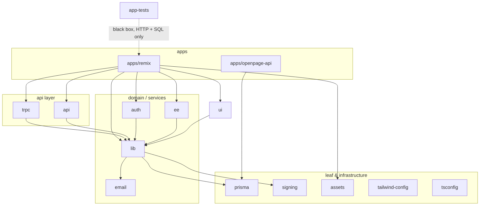

# Workspace Dependency Graph

Which workspace imports which, measured from source rather than from `package.json`. The repo is an npm-workspaces monorepo (`apps/*`, `packages/*`) driven by Turborepo; there are 15 workspaces, two of them apps.

Two graphs exist, and they disagree. The **declared** graph is what each `package.json` lists under `@documenso/*`. The **actual** graph is what the code imports. Twenty of the 42 real edges are not declared anywhere — they resolve at build time only because npm workspaces hoists every workspace into the root `node_modules/@documenso/`. That gap is the most useful thing this document records.

## Intended layering

Read top to bottom; arrows point at dependencies.



`app-tests` is deliberately outside the graph: it declares no `@documenso/*` dependency and talks to the running app over HTTP and to Postgres over raw `pg`. `packages/app-tests/e2e/fixtures/database.ts` states the reason — a handful of read-only queries don't justify pulling in `@documenso/prisma`.

## Actual edges

Counts are import statements, not files. "Type-only" means `import type`; those vanish at runtime and so are cheap to keep. "Declared" means the importing workspace lists the target in its own `package.json`.

| From → To | Total | Runtime | Type-only | Files | Declared |
| --- | --- | --- | --- | --- | --- |
| remix → ui | 1617 | 1566 | 51 | 395 | yes |
| remix → lib | 1277 | 1168 | 109 | 397 | yes |
| trpc → lib | 833 | 810 | 23 | 305 | yes |
| remix → trpc | 336 | 268 | 68 | 252 | yes |
| lib → prisma | 289 | 277 | 12 | 243 | yes |
| trpc → prisma | 210 | 209 | 1 | 157 | yes |
| ui → lib | 176 | 151 | 25 | 53 | yes |
| ee → lib | 121 | 111 | 10 | 46 | yes |
| auth → lib | 75 | 72 | 3 | 19 | yes |
| remix → auth | 61 | 59 | 2 | 56 | yes |
| api → lib | 53 | 51 | 2 | 5 | yes |
| remix → prisma | 53 | 32 | 21 | 50 | yes |
| lib → email | 42 | 40 | 2 | 32 | yes |
| **prisma → lib** | 28 | 20 | 8 | 9 | **no** |
| **trpc → ee** | 26 | 26 | 0 | 21 | **no** |
| **email → lib** | 21 | 18 | 3 | 18 | **no** |
| ee → prisma | 20 | 18 | 2 | 19 | yes |
| remix → ee | 20 | 18 | 2 | 16 | yes |
| **lib → trpc** | 13 | 3 | 10 | 8 | **no** |
| **lib → ui** | 13 | 9 | 4 | 10 | **no** |
| auth → prisma | 11 | 11 | 0 | 11 | yes |
| **lib → ee** | 9 | 9 | 0 | 8 | **no** |
| remix → assets | 9 | 9 | 0 | 9 | yes |
| **signing → lib** | 5 | 5 | 0 | 4 | **no** |
| **ui → trpc** | 4 | 4 | 0 | 4 | **no** |
| openpage-api → prisma | 3 | 3 | 0 | 3 | yes |
| **ee → auth** | 2 | 2 | 0 | 2 | **no** |
| **ee → email** | 2 | 2 | 0 | 1 | **no** |
| email → nodemailer-resend | 2 | 2 | 0 | 2 | yes |
| **lib → auth** | 2 | 1 | 1 | 1 | **no** |
| **prisma → trpc** | 2 | 2 | 0 | 2 | **no** |
| **trpc → auth** | 2 | 1 | 1 | 1 | **no** |
| **api → ee** | 1 | 1 | 0 | 1 | **no** |
| api → prisma | 1 | 1 | 0 | 1 | yes |
| **api → remix** | 1 | 0 | 1 | 1 | **no** |
| **api → trpc** | 1 | 1 | 0 | 1 | **no** |
| **auth → ee** | 1 | 1 | 0 | 1 | **no** |
| **lib → remix** | 1 | 0 | 1 | 1 | **no** |
| lib → signing | 1 | 1 | 0 | 1 | yes |
| remix → api | 1 | 1 | 0 | 1 | yes |
| **trpc → remix** | 1 | 0 | 1 | 1 | **no** |
| **ui → ee** | 1 | 1 | 0 | 1 | **no** |

Note that `@documenso/nodemailer-resend@5.0.0` is a published npm package, not a workspace — the `@documenso` scope is shared between internal workspaces and a few externally released packages.

Self-imports via a workspace's own package name are excluded from the table but are common in a naive grep: `lib` refers to `@documenso/lib` 263 times inside itself, `ui` 116 times, `api` 3, `trpc` 2.

## `lib` is the hub

`packages/lib` is on one end of 11 of the 15 heaviest edges. It has 282 files under `server-only/`, 73 under `jobs/`, 50 under `utils/`, plus `client-only/`, `universal/`, `types/` and `constants/` — server business logic, background-job handlers, browser-side React providers and shared constants in a single workspace. Everything above it in the graph depends on it, and it depends on almost everything below and several things above.

This makes it the practical bottleneck: a change in `lib` invalidates the Turborepo build cache for `trpc`, `api`, `auth`, `ee`, `ui` and both apps at once. Splitting it along the seams that already exist in its directory layout (`server-only` / `client-only` / `universal`) would let those consumers depend on only the slice they use, and would resolve most of the cycles below on its own.

## Cycles

Twelve two-node cycles exist. `Nr/Mt` = N runtime imports, M type-only.

| Cycle | Forward | Back |
| --- | --- | --- |
| lib ↔ ui | ui → lib: 151r/25t | lib → ui: 9r/4t |
| lib ↔ trpc | trpc → lib: 810r/23t | lib → trpc: 3r/10t |
| lib ↔ prisma | lib → prisma: 277r/12t | prisma → lib: 20r/8t |
| lib ↔ ee | ee → lib: 111r/10t | lib → ee: 9r/0t |
| lib ↔ email | lib → email: 40r/2t | email → lib: 18r/3t |
| lib ↔ auth | auth → lib: 72r/3t | lib → auth: 1r/1t |
| lib ↔ signing | signing → lib: 5r/0t | lib → signing: 1r/0t |
| lib ↔ remix | remix → lib: 1168r/109t | lib → remix: 0r/1t |
| trpc ↔ remix | remix → trpc: 268r/68t | trpc → remix: 0r/1t |
| trpc ↔ prisma | trpc → prisma: 209r/1t | prisma → trpc: 2r/0t |
| api ↔ remix | remix → api: 1r/0t | api → remix: 0r/1t |
| auth ↔ ee | ee → auth: 2r/0t | auth → ee: 1r/0t |

They fall into four kinds, and the fix differs per kind.

**Type-only back-edges — harmless, keep.** `lib → remix`, `trpc → remix` and `api → remix` are each a single `import type` and disappear after compilation. `packages/trpc/server/context.ts` and `packages/lib/universal/upload/put-file.ts` pull a Remix route type; `packages/api/hono.ts` does the same. A package borrowing a route's inferred type from the app is the price of end-to-end type safety in a Remix + tRPC setup. Worth leaving alone, worth not growing.

**Seed and dev-only back-edges — real but contained.** `prisma → lib` (9 files) and `prisma → trpc` (2 files) come almost entirely from `packages/prisma/seed/*` calling domain logic to build fixtures, plus `packages/prisma/types/*-legacy-schema.ts` reaching for `lib` types. The seed scripts sit in the same workspace as the schema they seed, which inverts the layering for code that never ships. Moving `seed/` to its own workspace (`@documenso/prisma-seed`) that depends on both `prisma` and `lib` would flatten this cleanly.

**Client/server tangle in `lib` — the one to actually fix.** `lib → ui` (10 files) and `lib → trpc` (8 files) are the layering violations with teeth, because they run in production. The files involved are the browser-side ones: `client-only/providers/envelope-editor-provider.tsx`, `client-only/providers/session.tsx`, `client-only/providers/organisation.tsx`, `universal/field-renderer/*`. These are React providers and renderers that happen to live in `lib`, so `lib` inherits dependencies on the UI kit and the API client. In the other direction `ui → trpc` (4 files: `document-share-button.tsx`, `document-flow/add-signers.tsx`, `document-flow/add-subject.tsx`, `template-flow/add-template-settings.tsx`) means shared presentational components fetch their own data, which is also why those components are hard to reuse. `packages/lib/server-only/document/send-document.ts` importing from `ui` is the clearest single symptom — server-side sending logic should have no reason to reach into the component library.

**Enterprise gating leaks downward.** `ee` is meant to be a leaf that the app opts into, but `lib → ee` (9 runtime imports), `trpc → ee` (26 runtime imports across 21 files), `ui → ee` and `api → ee` all reach up into it. On the `lib` side these are billing and seat-limit checks inside job handlers and organisation logic: `jobs/definitions/internal/seal-document.handler.ts`, `sync-organisation-seats.handler.ts`, `server-only/organisation/create-organisation.ts`, `utils/organisations-claims.ts`. On the `trpc` side most calls are in `enterprise-router/` and `admin-router/`, which is defensible, but `document-router/create-document.ts` and `create-document-temporary.ts` also call into `ee` — so the core document-creation path has an enterprise dependency compiled into it. `auth ↔ ee` closes a genuine two-way runtime cycle: `packages/auth/server/lib/utils/handle-oauth-organisation-callback-url.ts` calls into `ee`, while `packages/ee/server-only/lib/link-organisation-account.ts` and `limits/handler.ts` call back into `auth`. Inverting these with an interface owned by the lower layer (`lib` defines a claims/limits port, `ee` implements it, the app wires it up) is the standard fix and would remove four edges at once.

## Declared but unused

Seven declared dependencies produce no TypeScript import. Six are legitimate — they're consumed by config files rather than by code:

- `remix → tailwind-config` — referenced in `apps/remix/vite.config.ts` (`ssr.noExternal`) and as a `tsconfig.json` path.
- `ui → tailwind-config`, `email → tailwind-config` — consumed via CommonJS `require` in `packages/ui/tailwind.config.cjs` and `packages/email/tailwind.config.js`.
- `ui → tsconfig`, `email → tsconfig`, `signing → tsconfig` — consumed via `"extends": "@documenso/tsconfig/react-library.json"`. Note that eight other packages extend the same config without declaring it.

One appears genuinely dead: **`lib → assets`**. `@documenso/assets` appears nowhere in `packages/lib` except its own `package.json`; the only real consumers are nine files in `apps/remix`, which declares it correctly. Safe to drop from `packages/lib/package.json`.

## Turborepo's view

`turbo.json` defines `build` as `dependsOn: ["prebuild", "^build"]`, so the task graph is derived from declared `package.json` dependencies. Twenty undeclared edges are therefore invisible to it. In practice this is masked — every workspace hoists to the root `node_modules`, and `packages/lib` is in almost every declared dependency chain anyway, so cache invalidation ends up over-broad rather than unsound. But the guarantee isn't there: an undeclared edge is an edge Turborepo will not order builds around, and it's the reason `npm run build` correctness currently rests on hoisting rather than on the declared graph.

The cheap remediation, in order of value per unit of effort:

1. Declare the 20 missing edges (or delete them). This alone makes the task graph honest, and forces the cycles to be visible in `package.json` where reviewers see them.
2. Drop the dead `lib → assets` declaration.
3. Move `packages/prisma/seed/` into its own workspace — removes two back-edges.
4. Invert the `ee` dependencies behind a port owned by `lib` — removes four edges including the one true `auth ↔ ee` runtime cycle.
5. Split `lib` along its existing `server-only` / `client-only` / `universal` boundaries — removes the `lib → ui` and `lib → trpc` cycles and shrinks the cache-invalidation blast radius.

## Reproducing this

The numbers come from parsing `import` / `export … from` / `require()` statements in every git-tracked `.ts`, `.tsx`, `.mts`, `.cts`, `.mjs`, `.cjs` and `.js` file, attributing each to the workspace containing the file, and comparing against the `@documenso/*` entries in each workspace's `package.json`. A quick per-workspace edge listing:

```sh
for d in apps/* packages/*; do
  echo "=== $d"
  git ls-files "$d" | grep -E '\.(ts|tsx)$' \
    | xargs grep -ohE "from ['\"]@documenso/[a-z0-9-]+" 2>/dev/null \
    | grep -oE "@documenso/[a-z0-9-]+" | sort | uniq -c | sort -rn
done
```

Two caveats for anyone re-running it. Non-`import` references are missed by the snippet above — the `require()` calls in the Tailwind configs and the `tsconfig` `extends` chains need separate greps, which is why they show up as false positives in "declared but unused". And a workspace importing itself by package name inflates naive counts; those self-edges are excluded here.
