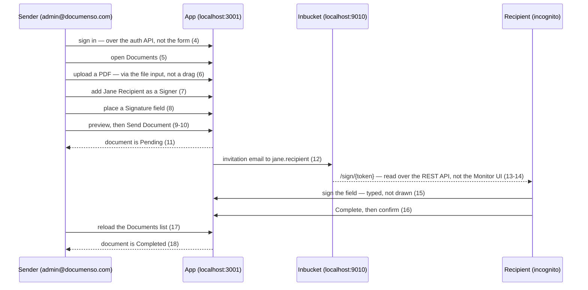

# E2E: Send and Sign a Document

A picture of `packages/app-tests/e2e/documents/send-and-sign-a-document.spec.ts`, which automates the user guide [Send a Document for Signature and Complete Signing](../user/guides/send-and-sign-a-document.md).

The step numbers below are the guide's, so the diagram, the guide, and the spec's comments all refer to the same steps. Where the test drives a step differently from the guide, the arrow says so.

## Actors

- **Sender** — the seeded `admin@documenso.com` account, which owns no seeded documents, so the one the test creates is the only one in its list.
- **App** — the production build under test on port 3001, backed by the test database on 54322. Both ports are deliberately disjoint from the development stack.
- **Inbucket** — the mail catcher in `docker/testing/compose.yml`. Its API is on **9010** in the test stack; the guide's `9000` is the development stack.
- **Recipient** — Jane, in a second browser context. She has no account; her only way in is the token in the email.

## What the diagram makes visible

**There are two browser contexts, not one.** The second context is the automated equivalent of the guide's incognito window. It exists for two reasons: the recipient must not be signing while carrying the sender's session cookie, and the sender's context has to stay signed in so it can perform the final check in steps 17-18. Both are live at the same time.

**Inbucket is a participant, not a detail.** The signing token is never read out of the database — it reaches the recipient only by email. That makes the invitation itself part of what the test covers: if the mail job stops firing, or the link in the template breaks, the test fails at step 12 rather than quietly working around it.

## Steps not shown

Steps 1-3 (start the stack, reset the database, open the app) are the responsibility of `npm run test:e2e`, not the spec. Steps 19-20 (inspect the signed PDF, confirm the other seeded account is untouched) are deliberately out of scope, so the test stops at the Completed status.
